# Optimisation du Raffinage et de la Pétrochimie par Deep Learning
### Rapport de projet — Jumeau numérique CDU & Vapocraqueur

---

## 1. Le problème

Une raffinerie traitant **200 000 barils/jour** exploite une unité de distillation atmosphérique
(**CDU**) et un **vapocraqueur**, deux goulets d'étranglement du site. L'objectif est de
construire un système capable de :

1. **Prédire les rendements des coupes** (naphta, kérosène, gazole, résidu)
2. **Détecter les dérives opérationnelles et le fouling** (encrassement des échangeurs)
3. **Optimiser les paramètres de distillation** (température du four, pression, reflux)
4. **Réduire la consommation énergétique de 5-10 %**
5. **Prédire la qualité produit** et **alerter en temps réel**

| # | Objectif | Critère de succès |
|---|----------|--------------------|
| 1 | Prédire les rendements | MAPE < 5 % par coupe |
| 2 | Détecter le fouling | Détection > 24 h avant nettoyage nécessaire |
| 3 | Optimiser la température du four | Gain énergétique > 5 % |
| 4 | Prédire la qualité des produits | Corrélation > 0.9 avec le labo |
| 5 | Déployer un système d'alerte | Temps réel (< 1 min) |

Toutes les données sont **100 % synthétiques**, générées à partir de bilans matière et
énergétiques d'une CDU et d'un vapocraqueur (`src/data_generator.py`) — 2 ans de données
horaires (~17 500 points), plus un échantillonnage labo toutes les 8 h avec 4 h de délai.

**Contrainte de méthode : Deep Learning uniquement.** Aucun algorithme de ML classique
(XGBoost, Random Forest, régression linéaire/logistique, SVM, k-means...) — uniquement des
réseaux de neurones PyTorch. scikit-learn n'est utilisé que pour `StandardScaler`, les métriques
et le split train/val/test.

**Méthodologie de mesure** — pour rendre les comparaisons honnêtes, chaque tâche est évaluée
avec **plusieurs métriques complémentaires**, jamais une seule :
- **Régression** (rendements, énergie, qualité) : MAPE (%, erreur relative — intuitive mais
  instable quand la cible est proche de zéro), **RMSE** (erreur absolue, dans l'unité de la
  cible — pénalise davantage les grosses erreurs), et **R²** (fraction de variance expliquée —
  situe le modèle par rapport à une baseline "prédire la moyenne").
- **Classification** (fouling) : precision, recall, F1, **accuracy**, AUC — et deux métriques
  ajoutées après coup car les quatre précédentes se sont révélées peu informatives ici (voir
  §3.3) : l'**avance moyenne de détection** (métier) et la **corrélation à la vérité terrain
  cachée**.

---

## 2. Techniques de Deep Learning utilisées — étude comparative

| Famille | Modèles | Utilisés pour |
|---|---|---|
| Dense | MLP | Baseline rendements, surrogate énergétique |
| Récurrent | RNN simple, LSTM, GRU, LSTM bidirectionnel | Rendements, soft sensor qualité, résidu de fouling |
| Convolutionnel | CNN 1D, TCN (dilaté causal) | Rendements |
| Hybride | CNN-LSTM | Disponible dans `src/models/cnn.py` |
| Attention | Transformer encoder (positional encoding, multi-head) | Rendements |
| Non supervisé | Autoencodeur dense, conv1D, LSTM seq2seq, VAE | Détection de fouling |
| Optimisation | Surrogate MLP + descente de gradient sur les entrées | Optimisation énergétique |

**Comparatif rapide (notebook 03, tâche rendements) :**

| Architecture | Avantage principal | Limite observée |
|---|---|---|
| **RNN simple** | Meilleur compromis biais/variance sur cette tâche ; peu de paramètres | Mémoire courte, moins robuste sur séquences très longues |
| LSTM / GRU / BiLSTM | Mémoire longue via portes | Plus de paramètres, sur-paramétrés ici (peu de gain, parfois moins bon) |
| TCN | Champ réceptif large, parallélisable | Sensible au choix du nombre de blocs |
| Transformer | Capture les dépendances globales via attention | Plus lent à entraîner, a besoin de plus de données pour exceller |
| CNN 1D | Rapide, capture des motifs locaux | Champ réceptif par couche limité — le pire des 8 ici |
| MLP (baseline) | Simple, rapide | Ignore l'historique temporel |

Sur ce jeu de données (fenêtres de 24 h, signal dominé par les conditions récentes — confirmé
par l'ACF/PACF du notebook 01), les architectures **plus simples** (RNN, TCN, MLP) égalent voire
dépassent les architectures plus complexes (LSTM, BiLSTM, GRU, Transformer) : la tâche ne
nécessite pas une mémoire très longue, et le jeu d'entraînement (~12 300 séquences) est trop
petit pour que la capacité supplémentaire des architectures profondes se traduise en un vrai
gain — illustration concrète du compromis capacité du modèle / taille du jeu de données (voir
l'analyse détaillée §3.2).

Pour la détection de fouling (notebook 04), les **autoencodeurs** (entraînés uniquement sur des
périodes "propres") détectent une dérive via l'erreur de reconstruction globale (83 variables) ;
l'approche par **résidu GRU** prédit directement un unique capteur physiquement piloté par le
fouling (température de sortie du train de préchauffe) et surveille l'écart mesuré/prédit — plus
ciblée, elle se révèle nettement plus corrélée à la vérité terrain cachée (§3.3).

Pour l'optimisation énergétique (notebook 05), un **réseau surrogate** remplace un bilan
énergétique complet par un modèle différentiable, permettant une **descente de gradient sur les
entrées** (COT, reflux) — une alternative légère à une recherche exhaustive ou à un solveur
d'optimisation classique.

### Illustrations schématiques des architectures

Les schémas ci-dessous illustrent chaque architecture utilisée dans le projet (prompts de
génération et noms de fichiers exacts fournis séparément) :

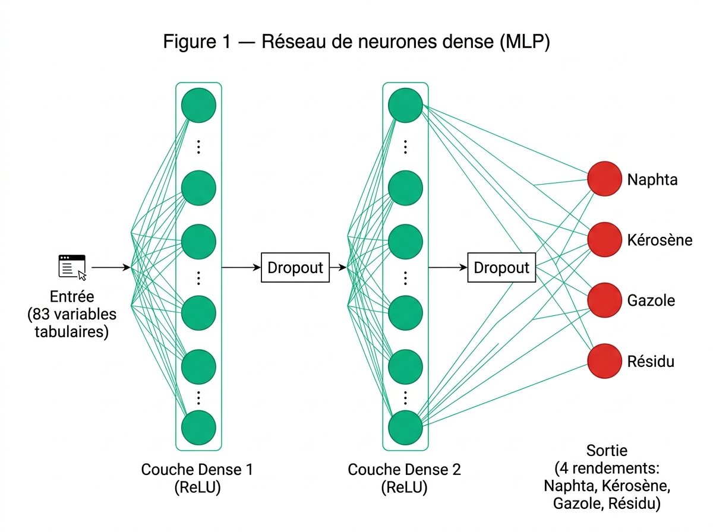
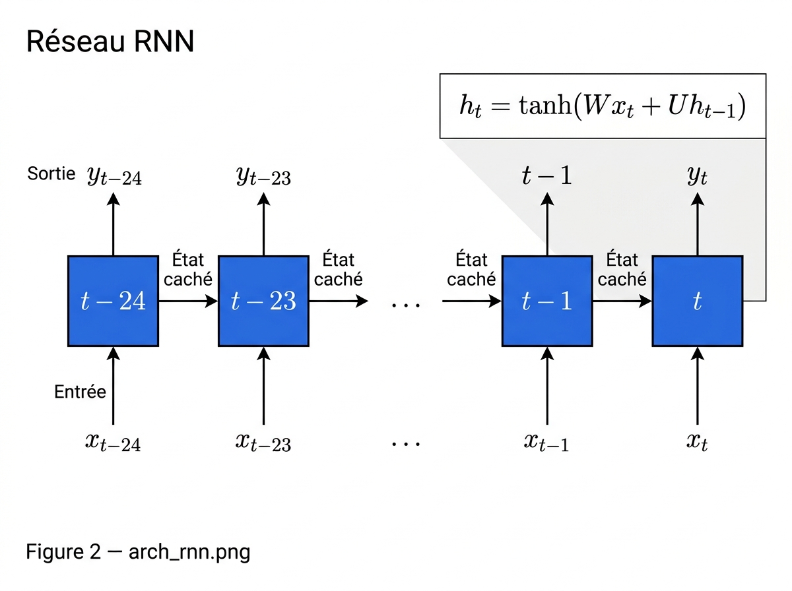
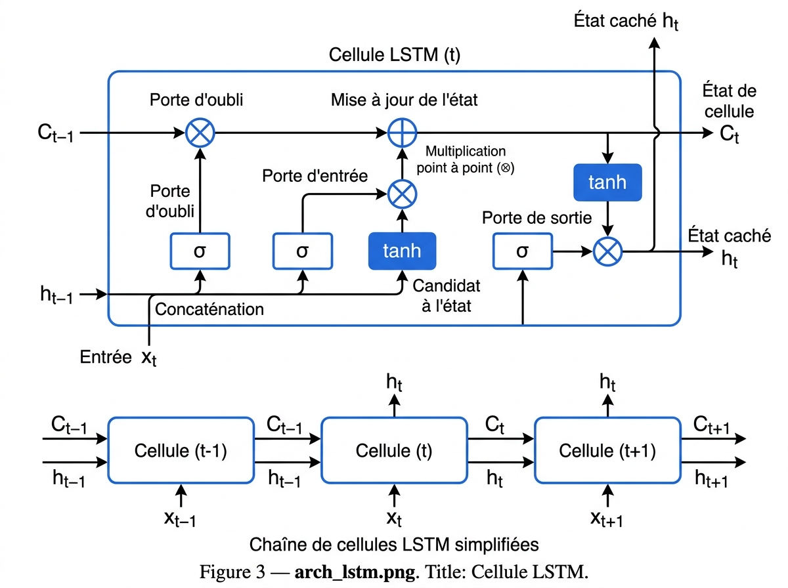
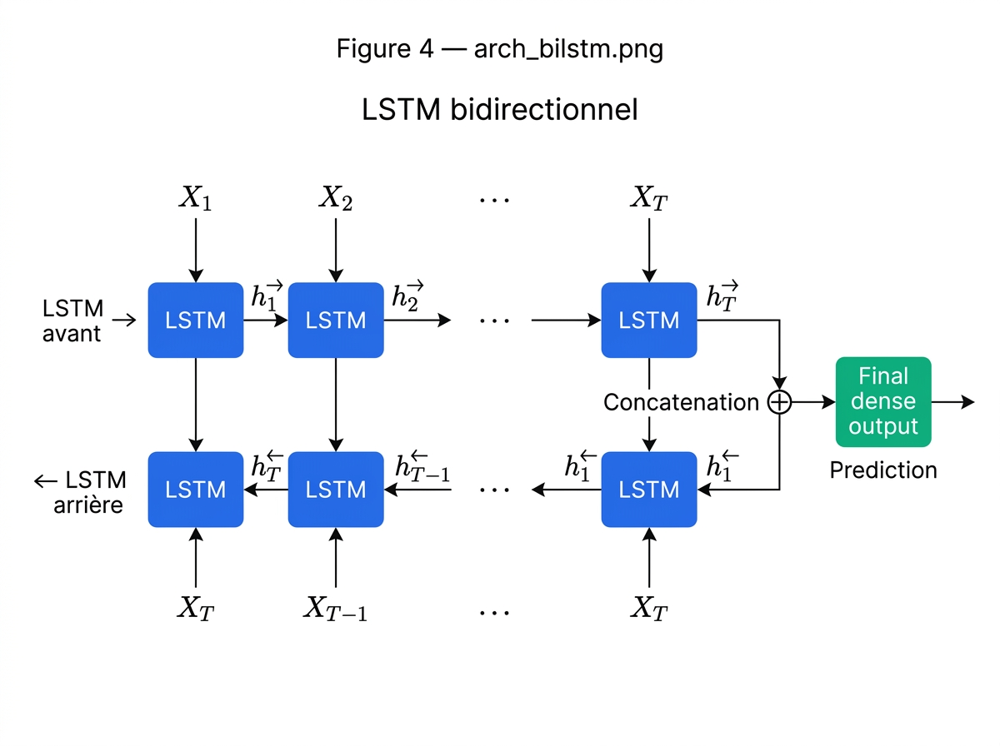
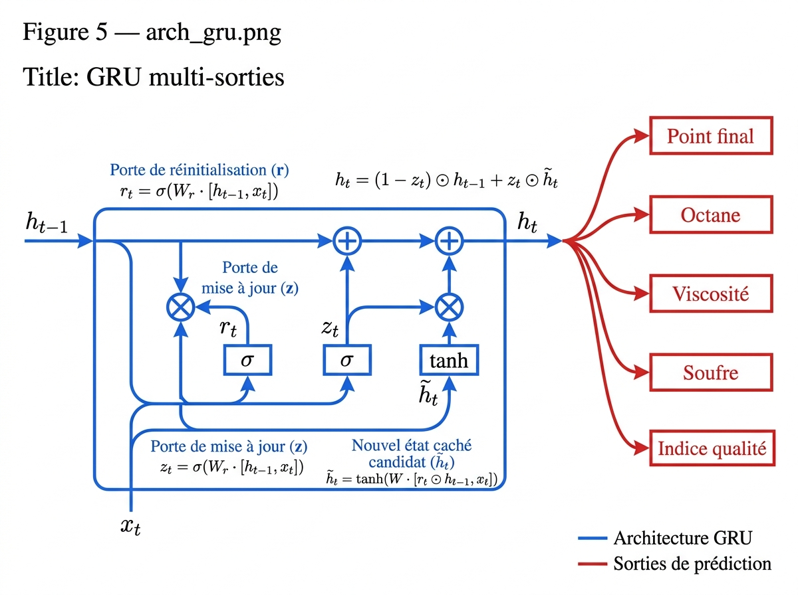
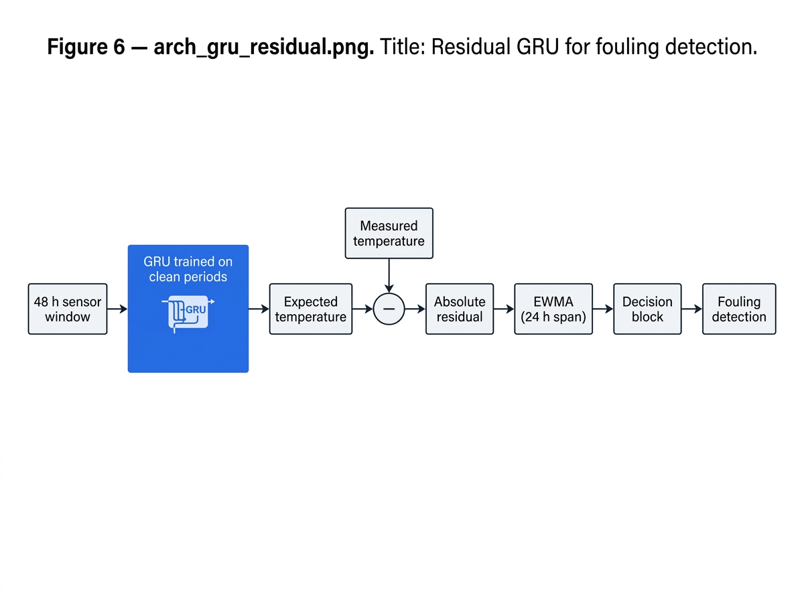
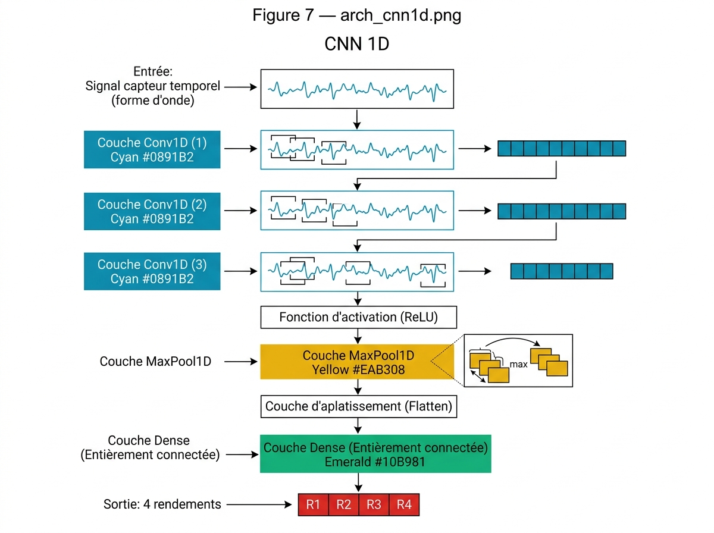
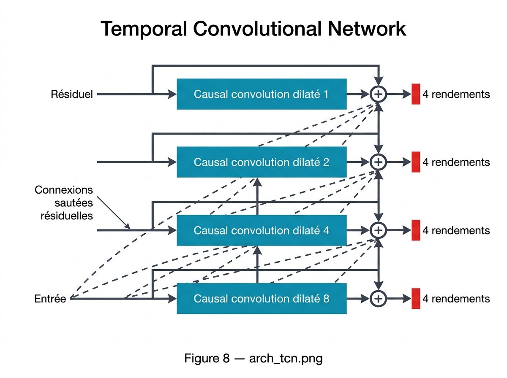
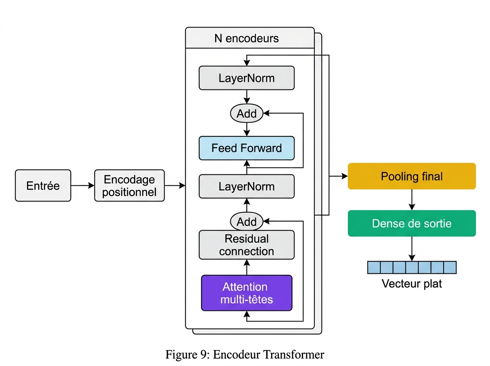
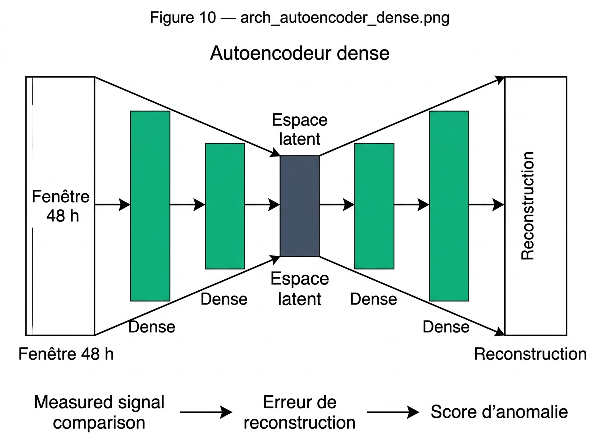
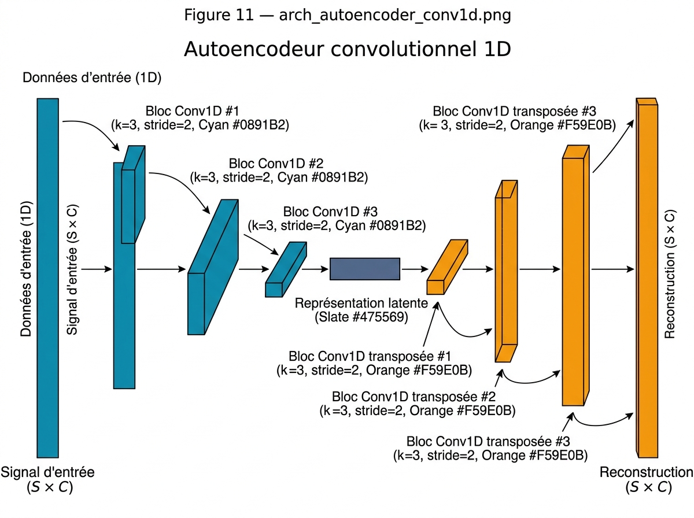
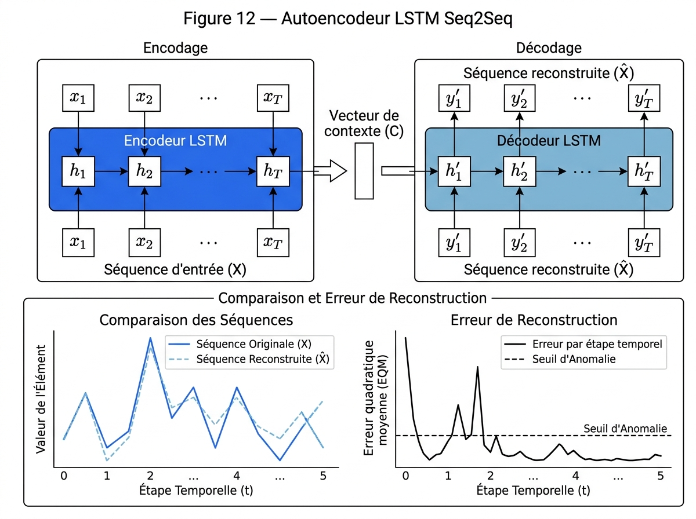
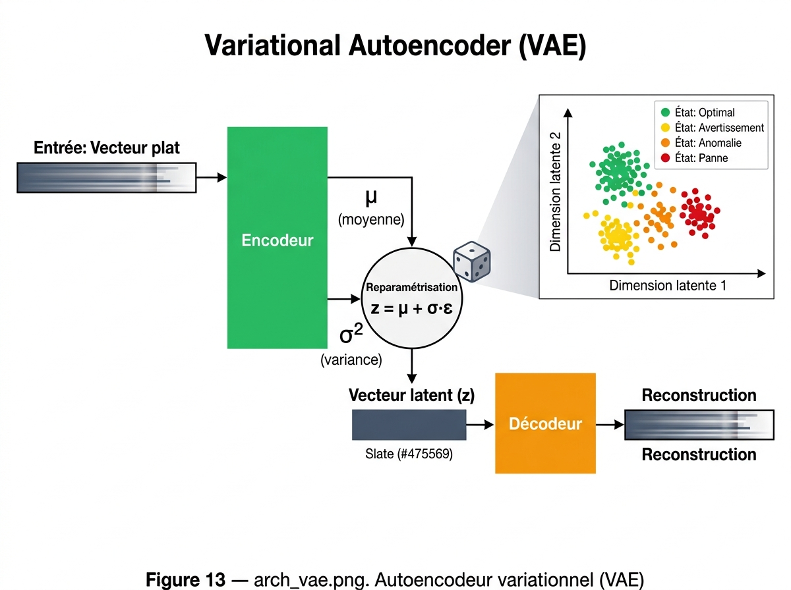
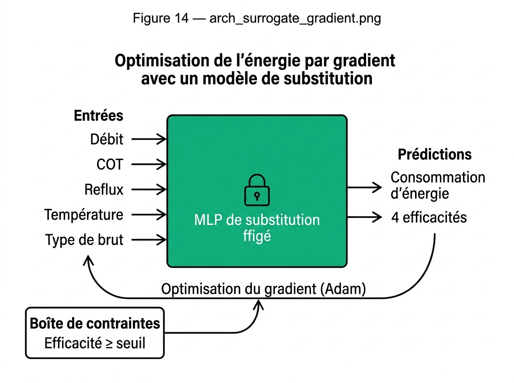

---

## 3. Résultats détaillés par notebook

### 3.1 Notebooks 01-02 — Exploration et préprocessing

Statistiques descriptives, valeurs manquantes et outliers injectés volontairement, cycle de
fouling (4 nettoyages sur 2 ans), décomposition STL, ACF/PACF (justifiant la fenêtre de 24 h).
Préprocessing : imputation temporelle, correction de dérive capteur, jointure asof avec le labo
respectant le délai de 4 h (zéro fuite), split temporel strict 70/15/15, `StandardScaler` fit
sur train uniquement.

### 3.2 Notebook 03 — Prédiction des rendements (8 architectures)

| Architecture | MAPE naphta | MAPE kéro. | MAPE gazole | MAPE résidu | **MAPE globale** | **RMSE globale** | **R² global** | Params | Temps (s) | Taille (Mo) |
|---|---|---|---|---|---|---|---|---|---|---|
| **RNN simple** | 4.95 % | 1.82 % | 1.12 % | 4.06 % | **2.99 %** | **0.0137** | **0.861** | 13 956 | 52.9 | 0.056 |
| TCN | 5.30 % | 2.16 % | 1.24 % | 4.32 % | 3.26 % | 0.0143 | 0.840 | 42 884 | 103.1 | 0.170 |
| MLP (baseline) | 5.37 % | 2.24 % | 1.22 % | 4.20 % | 3.26 % | 0.0142 | 0.842 | 19 652 | 24.1 | 0.081 |
| LSTM | 5.37 % | 2.23 % | 1.25 % | 4.31 % | 3.29 % | 0.0144 | 0.834 | 75 844 | 114.4 | 0.293 |
| LSTM bidirectionnel | 5.52 % | 2.12 % | 1.28 % | 4.43 % | 3.34 % | 0.0144 | 0.831 | 184 132 | 185.8 | 0.708 |
| GRU | 5.76 % | 2.29 % | 1.25 % | 4.28 % | 3.40 % | 0.0146 | 0.833 | 57 988 | 161.5 | 0.225 |
| Transformer | 6.06 % | 2.38 % | 1.42 % | 4.41 % | 3.57 % | 0.0152 | 0.802 | 74 660 | 314.7 | 0.421 |
| CNN 1D | 6.85 % | 2.67 % | 1.74 % | 5.49 % | 4.19 % | 0.0160 | 0.740 | 29 092 | 79.4 | 0.120 |

**Résultat : objectif MAPE < 5 % atteint par coupe (RNN simple, 2.99 % global). ✅**

**Pourquoi le RNN simple gagne — et pourquoi les 3 métriques racontent la même histoire.**
MAPE, RMSE et R² classent les 8 architectures **dans le même ordre** (du RNN simple, meilleur
sur les 3, au CNN 1D, pire sur les 3) — un signal que le classement est robuste et ne tient pas
à un artefact d'une métrique en particulier. Explication : la fenêtre d'entrée ne fait que 24 h,
et l'ACF/PACF (notebook 01) montre que le rendement dépend surtout des conditions **récentes**
(quelques heures), pas d'un historique long. Les architectures à grande capacité de mémoire
(LSTM, BiLSTM, GRU, Transformer — 58k à 184k paramètres) n'ont donc rien de plus à exploiter que
le RNN simple (14k paramètres), tout en étant plus difficiles à entraîner sur seulement ~12 300
séquences d'entraînement (risque de sur-paramétrisation). Le CNN 1D est le seul cas
qualitativement différent : son champ réceptif par couche est trop court pour couvrir toute la
fenêtre de 24 h avec seulement 3 blocs, d'où le R² le plus faible (0.740) — le TCN, qui résout
ce problème par des convolutions **dilatées**, obtient au contraire le 2ᵉ meilleur score.

**Courbes d'apprentissage des 8 architectures** (loss + MAPE de validation à chaque epoch) :

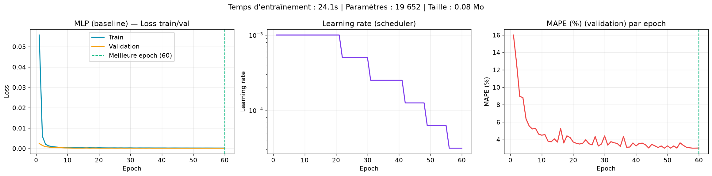
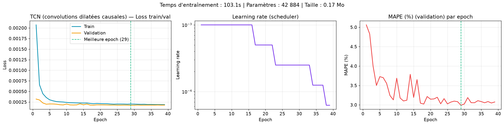
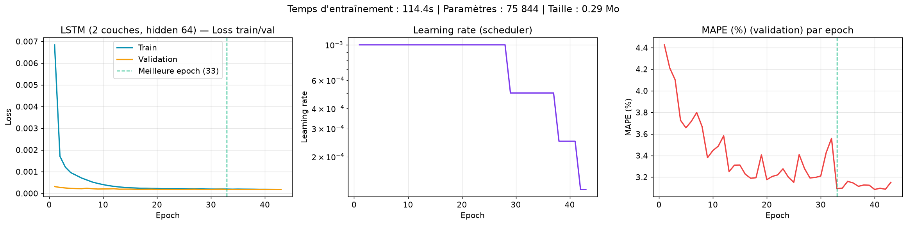
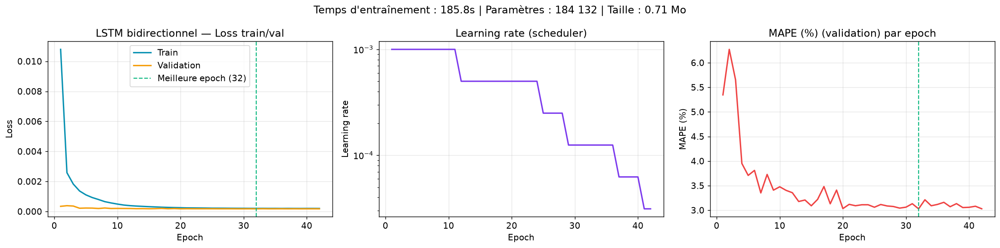
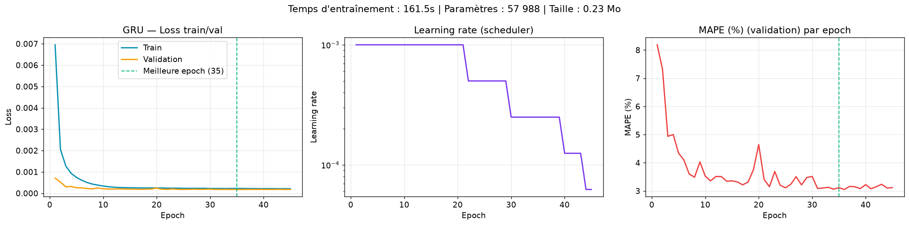
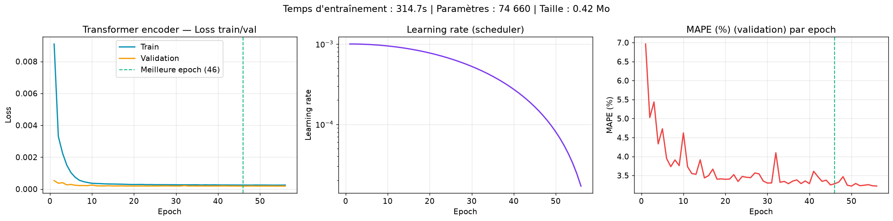
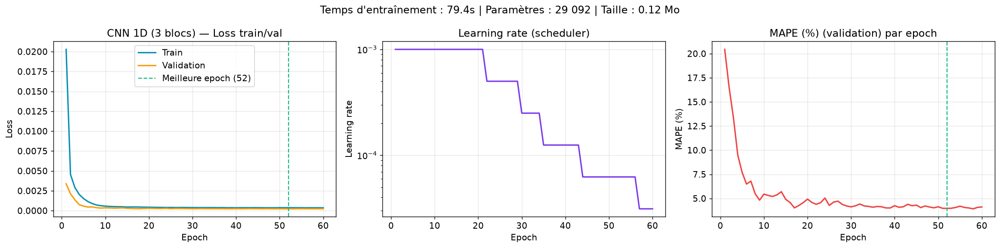

Mini-études complémentaires : comparaison d'optimiseurs (SGD vs Adam vs AdamW) et effet du
dropout (0.0/0.2/0.4) sur le sur-apprentissage du LSTM.

### 3.3 Notebook 04 — Détection du fouling (5 approches)

| Méthode | Precision | Recall | F1 | **Accuracy** | AUC | Avance de détection | Corr. vérité terrain | Paramètres |
|---|---|---|---|---|---|---|---|---|
| **Résidu GRU** | 0.009 | 0.323 | 0.018 | 0.802 | 0.671 | 3022 h | **0.490** | 57 793 |
| Autoencodeur dense | 0.035 | 0.135 | 0.055 | **0.975** | 0.780 | 2144 h | 0.265 | 516 128 |
| Autoencodeur conv1D | 0.010 | 0.573 | 0.019 | 0.678 | 0.589 | 3752 h | 0.250 | 19 331 |
| Autoencodeur LSTM (seq2seq) | 0.024 | 0.469 | 0.046 | 0.894 | 0.652 | 4114 h | 0.153 | 26 163 |
| VAE | 0.006 | 0.156 | 0.012 | 0.861 | 0.602 | 3974 h | 0.062 | 259 808 |

**Résultat : les 5 méthodes dépassent largement l'objectif de 24 h d'avance. ✅**

**Pourquoi precision/F1 sont quasi nuls pour toutes les méthodes, et pourquoi l'accuracy est
trompeuse ici (le "paradoxe de l'accuracy").** Sur les 17 496 heures de test, seules **96 (0.55
%)** sont réellement étiquetées `cleaning_needed_within_24h=1` (5 nettoyages en 2 ans, fenêtre de
24 h chacun). Détail du calcul pour le résidu GRU (méthode de production) :

| | |
|---|---|
| Heures totales | 17 496 |
| Heures réellement positives | 96 (0.55 %) |
| Heures signalées "alerte" par le modèle | 3 443 (19.7 %) |
| dont vrais positifs (TP) | 31 |
| dont faux positifs (FP) | 3 412 |
| **Precision** = TP/(TP+FP) | 31/3443 = **0.9 %** |
| **Recall** = TP/(TP+FN) | 31/96 = **32.3 %** |
| **Accuracy** = (TP+TN)/total | (31+13 988)/17 496 = **80.2 %** |

Avec une base rate de seulement 0.55 %, un signalement **aléatoire** au même taux d'alerte
(19.7 %) obtiendrait ≈19 TP par pur hasard — le modèle en obtient 31, un signal réel mais modeste
(cohérent avec son AUC de 0.671). Le F1, moyenne harmonique de precision et recall, s'effondre
vers la plus petite des deux valeurs dès qu'elles sont aussi déséquilibrées : F1 ≈ 0.018 est
donc une conséquence arithmétique normale, pas une anomalie.

**L'accuracy, elle, induit en erreur dans l'autre sens** : l'autoencodeur dense obtient
**97.5 % d'accuracy** — la meilleure des 5 — simplement parce qu'il déclenche beaucoup moins
d'alertes au total (donc moins de FP), pas parce qu'il détecte mieux le fouling. Il ne rappelle
que 13.5 % des vraies heures positives et sa corrélation à la vérité terrain cachée n'est que de
0.265, contre 0.490 pour le résidu GRU. Sur un problème aussi déséquilibré (99.45 % de négatifs),
l'accuracy est dominée par la classe majoritaire et **ne doit jamais être lue seule** — c'est
exactement pourquoi ce projet a ajouté deux métriques métier (avance de détection, corrélation à
la vérité terrain) plutôt que de choisir le modèle de production sur F1/accuracy.

**Modèle de production : résidu GRU** — il prédit spécifiquement la température de sortie du
train de préchauffe (directement pilotée par le fouling dans le générateur de données) plutôt que
de reconstruire les 83 variables du procédé, ce qui explique sa bien meilleure corrélation à la
vérité terrain (0.490 contre 0.062–0.265 pour les 4 autres, qui réagissent à toute variation
opératoire — changement de brut, rampe de charge — pas seulement au fouling). Score lissé par
EWMA causal (span 24 h) pour limiter le bruit du résidu brut.

**Courbes d'apprentissage des 5 approches** (les 4 autoencodeurs sont entraînés en
reconstruction sur des séquences "propres" uniquement ; le résidu GRU est entraîné en régression
sur `preheat_outlet_temp`) :

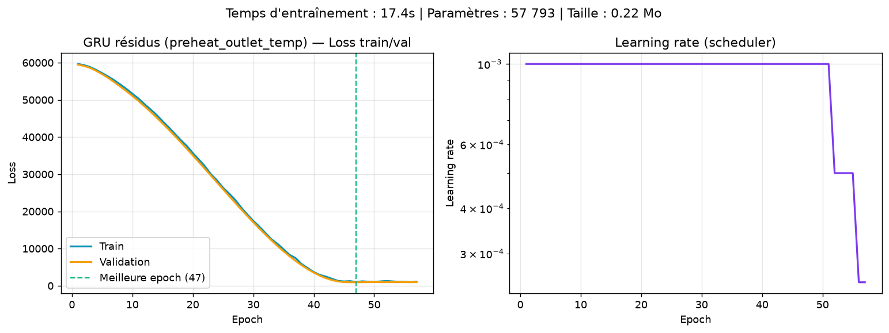
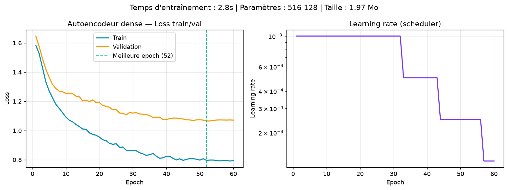
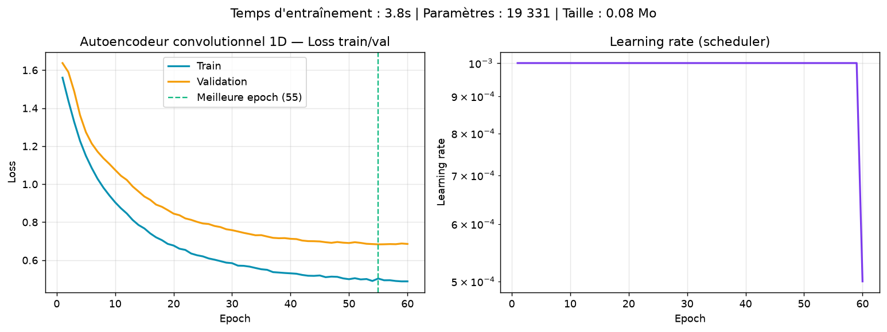
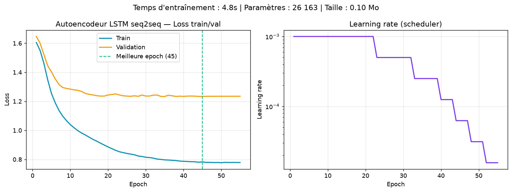
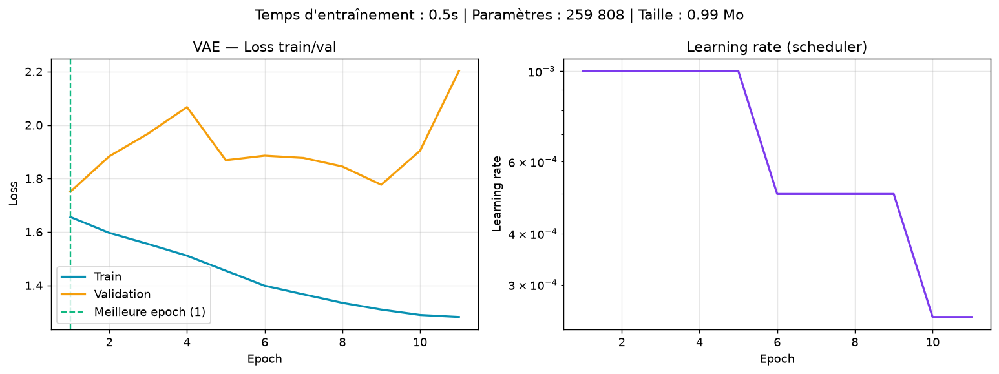

### 3.4 Notebook 05 — Optimisation énergétique

Surrogate MLP (128-128-64, BatchNorm + Dropout 0.3) entraîné à prédire (4 rendements + énergie
spécifique) à partir des conditions opératoires instantanées (jeu de données non séquentiel,
contrairement aux notebooks 03/04 — nécessaire pour que la descente de gradient sur COT/reflux
ait un sens physique direct). Optimisation par descente de gradient sur COT/reflux (poids du
surrogate gelés), sous contrainte de préservation des rendements.

**Performance du surrogate par sortie (jeu de test) :**

| Cible | R² | MAPE | RMSE |
|---|---|---|---|
| Rendement naphta | 0.905 | 4.96 % | 0.0168 |
| Rendement kérosène | 0.914 | 1.90 % | 0.0063 |
| Rendement gazole | 0.539 | 1.39 % | 0.0054 |
| Rendement résidu | 0.933 | 4.05 % | 0.0200 |
| Énergie spécifique | **-0.123** | 7.94 % | 0.1587 |

**Pourquoi l'énergie spécifique a un R² négatif malgré un MAPE raisonnable.** Dans le générateur
de données, `specific_energy` est piloté **principalement par le fouling caché** (jamais une
feature) et le débit — pas par COT/reflux. Pour que la descente de gradient ait un signal à
exploiter, ce notebook ajoute un terme correctif physique explicite et documenté
(`+0.006 kWh/bbl/°C` au-dessus du COT setpoint, `+0.20 kWh/bbl` par unité de reflux au-dessus de
la borne basse) — un signal volontairement **faible** comparé à la variance totale (dominée par
le fouling, non observable). Résultat : l'erreur absolue du modèle (RMSE 0.159 kWh/bbl, sur une
cible qui varie peu autour de ~1.35-1.4 kWh/bbl) n'est pas meilleure que prédire la moyenne — R²
négatif — alors que le MAPE (7.94 %) paraît correct. Ceci n'invalide pas l'optimisation : la
descente de gradient n'a besoin que de la **sensibilité directionnelle** correcte
(∂énergie/∂COT, ∂énergie/∂reflux), pas d'une prévision absolue parfaite — le gain de 5.53 %
obtenu en backtest (ci-dessous) le confirme. Le rendement gazole a le même symptôme à moindre
échelle (R²=0.539 malgré un MAPE bas de 1.39 %) : sa plage de variation dans les données est
petite, donc même une erreur relative faible laisse peu de variance "expliquée" par rapport au
bruit.

**Résultats de l'optimisation (backtest) :**

| Métrique | Valeur |
|---|---|
| Gain énergétique (gradient) | **5.53 %** ✅ (objectif > 5 %) |
| Comparaison random search | 7.68 % (référence, sans garantie de respect des contraintes) |
| Respect de la contrainte de rendement | 96.3 % des échantillons |
| Économies | **≈ 774 $/jour**, 4.13 tCO₂/jour évitées |

### 3.5 Notebook 06 — Soft sensor qualité + pipeline temps réel

GRU multi-sorties (5 cibles qualité labo) entraîné sur fenêtres de 24 h de conditions
opératoires. Cibles standardisées séparément (échelles très différentes, ex. `residue_viscosity`
~385 vs `sulfur_content` ~1.2) pour un apprentissage équilibré, puis dé-standardisées avant
évaluation (métriques en unités réelles).

| Cible qualité | Corrélation | MAPE | RMSE |
|---|---|---|---|
| Point final naphta (°C) | 0.966 | 0.76 % | 1.646 |
| Point éclair kérosène (°C) | 0.965 | 1.36 % | 0.804 |
| Indice de cétane gazole | 0.972 | 1.41 % | 0.856 |
| Viscosité résidu (cSt) | 0.967 | 1.52 % | 7.667 |
| Teneur en soufre (%pds) | 0.985 | 8.54 % | 0.133 |
| **Moyenne (corrélation)** | **0.971** ✅ (objectif > 0.9) | — | — |

**Pourquoi le soufre a la meilleure corrélation mais le pire MAPE.** `sulfur_content` a la plus
petite échelle absolue (~1.2 %pds en moyenne) : une erreur absolue faible (RMSE 0.133, la plus
petite des 5) se traduit en erreur **relative** élevée (8.54 %) simplement parce qu'on divise par
un petit nombre. À l'inverse, `residue_viscosity` a la plus grosse erreur absolue (RMSE 7.67 cSt)
mais sur une échelle ~385 cSt, donc un MAPE bas (1.52 %). La corrélation, invariante à l'échelle,
montre que le modèle capture bien la **forme** de variation des deux cibles (0.985 et 0.967) —
c'est exactement pourquoi aucune métrique seule ne suffit : RMSE dépend de l'unité, MAPE explose
sur les petites échelles, la corrélation ne dit rien de l'erreur absolue.

**Pipeline temps réel** : rejeu heure par heure du jeu de test (2633 h), 3 réseaux en inférence
continue (rendements, fouling, qualité) + moteur d'alertes (anti-rebond). **Latence mesurée :
22.6 ms en moyenne, 36.6 ms (p95), 174.0 ms (max)** — objectif < 1 min largement tenu. 107
alertes générées lors du backtest (101 warning, 6 critical) : 66 rendements/dérive, 35 qualité,
5 fouling, 1 énergie.

### 3.6 Synthèse finale (générée automatiquement — `model_report.md`)

| # | Objectif | Critère | Résultat | Statut |
|---|----------|---------|----------|--------|
| 1 | Rendements | MAPE < 5 % | 2.99 % (RNN simple) | ✅ |
| 2 | Fouling | > 24 h avant nettoyage | 3022 h (résidu GRU, corr. vérité terrain 0.49) | ✅ |
| 3 | Énergie | Gain > 5 % | 5.53 % (774 $/j, 4.13 tCO₂/j) | ✅ |
| 4 | Qualité | Corrélation > 0.9 | 0.971 | ✅ |
| 5 | Alertes temps réel | Latence < 1 min | ~23 ms (max 174 ms) | ✅ |

**5/5 objectifs atteints.**

---

## 4. Du jumeau numérique aux données réelles — pipeline de déploiement

Le dashboard actuel rejoue un jeu de test **synthétique** figé. Le schéma ci-dessous montre ce
qui changerait (et ce qui ne changerait pas) pour un déploiement sur une raffinerie réelle :

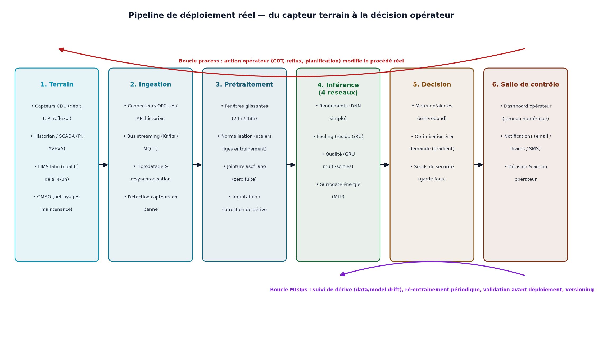

| Étape | En synthétique (aujourd'hui) | En réel (déploiement) |
|---|---|---|
| 1. Terrain | `src/data_generator.py` (bilans simplifiés) | Capteurs CDU (DCS/PLC), historian (PI/AVEVA), LIMS labo, GMAO |
| 2. Ingestion | Lecture de CSV (`data/raw/`) | Connecteurs OPC-UA / API historian, bus streaming (Kafka/MQTT), horodatage et resynchronisation, détection de capteurs en panne |
| 3. Prétraitement | `src/preprocessing.py` (identique) | **Même code** : fenêtres glissantes, scalers figés au train, jointure asof labo (zéro fuite), imputation/correction de dérive |
| 4. Inférence | 4 réseaux rejoués sur le jeu de test | **Mêmes 4 réseaux** servis par le même backend FastAPI, sur des tenseurs construits à partir de données réelles |
| 5. Décision | Alertes simulées, aucune action réelle | Moteur d'alertes réel + garde-fous de sécurité, recommandations d'optimisation **validées par un opérateur humain** avant écriture d'une consigne au DCS (human-in-the-loop, pas d'automatisation directe) |
| 6. Boucle MLOps | Aucune (jeu figé) | Archivage prédictions vs réel, suivi de dérive (MAPE/corrélation glissants), ré-entraînement périodique avec validation avant redéploiement des artefacts (`.pt`) |

Point clé : **l'architecture logicielle ne change pas** (`src/`, `backend/`, `frontend/`) — seule
la source de données change (CSV rejoués → flux temps réel du DCS/historian). C'est une
conséquence directe du découplage préprocessing/inférence déjà en place : le même
`ModelRegistry` et les mêmes artefacts `.pt` peuvent servir un jeu de test ou un flux réel, à
condition que le pipeline de features réel produise des tenseurs dans le même ordre de colonnes
et les mêmes unités que `fouling_feature_names.joblib` / `yields_feature_names.joblib` / etc.

---

## 5. Le dashboard — jumeau numérique

### 5.1 Ce qu'il fait

Le dashboard consomme le backend FastAPI (`/api/*` + WebSocket `/ws/realtime`) qui rejoue en
continu le jeu de test (1 h de données simulées par tick de 2 s) à travers les 4 modèles de
production (rendements, fouling, qualité, surrogate énergie), génère des alertes, et diffuse un
état complet (`TwinState`) à tous les clients connectés.

### 5.2 Pages et rôle

| Page | Rôle |
|---|---|
| **Vue d'ensemble (`/`)** | KPI temps réel (débit, rendement distillats, énergie, fouling, alertes), aire empilée des 4 rendements sur fenêtre glissante 48 h, flux d'alertes, compteurs de gains |
| **Jumeau numérique (`/jumeau`)** | Synoptique interactif du procédé complet (React Flow) : Brut → Dessaleur → Train de préchauffe → Four → Colonne → Vapocraqueur, avec capteurs live et santé des équipements calculée par les modèles |
| **Rendements (`/rendements`)** | Courbes prédit/réel par coupe, jauges de MAPE, simulateur what-if (sliders COT/reflux/débit → prédiction instantanée) |
| **Encrassement (`/encrassement`)** | Indice de fouling (résidu GRU), estimation du délai avant nettoyage, historique 60 jours vs vérité terrain (normalisée sur le seuil de nettoyage physique), épisodes de détection |
| **Énergie (`/energie`)** | Comparaison énergie réelle vs optimisée, bouton d'optimisation à la demande, compteurs cumulés d'économies |
| **Alertes (`/alertes`)** | Journal filtrable des alertes (niveau, type, équipement) |
| **Documentation (`/documentation`)** | Récapitulatif des objectifs, des 8 architectures comparées, schéma d'architecture |

### 5.3 Aperçu visuel

---

## 6. Stack technique

| Composant | Technologie | Pourquoi |
|---|---|---|
| Deep Learning | PyTorch, torchinfo, tqdm | Framework standard, flexible, CPU-friendly pour ce volume de données |
| Backend | FastAPI, Pydantic v2, uvicorn, WebSockets | Async natif, validation de schéma stricte, WebSocket intégré pour le temps réel |
| Frontend | Next.js (App Router, TypeScript) | Rendu hybride SSR/CSR, écosystème React mature |
| UI | Tailwind CSS, shadcn/ui | Composants accessibles, thème sombre personnalisable rapidement |
| Graphiques | Recharts | Déclaratif, s'intègre nativement à React, suffisant pour courbes/aires/jauges |
| Synoptique | @xyflow/react (React Flow) | Seule librairie React mature pour diagrammes de flux interactifs avec nœuds custom |
| Données/état | TanStack Query, zustand | Cache de requêtes + état global léger, sans Redux |
| Animations | framer-motion | Transitions déclaratives (pulsation d'alarme, entrées) |
| Icônes | lucide-react | Icônes cohérentes, légères, tree-shakable |
| Conteneurisation | Docker, docker-compose | Reproductibilité, isolation backend/frontend |
| Environnement Python | `uv` | Résolution rapide, gestion simple des versions Python |

### Icônes à télécharger (facultatif, pour habiller le rapport LaTeX)

Le dashboard utilise déjà **lucide-react** (icônes vectorielles intégrées, pas de téléchargement
nécessaire pour l'app elle-même). Pour illustrer ce rapport LaTeX avec des logos de
technologies, télécharger si besoin (usage libre, marques déposées de leurs propriétaires
respectifs) :
- PyTorch : https://pytorch.org/assets/images/pytorch-logo.png
- FastAPI : https://fastapi.tiangolo.com/img/logo-margin/logo-teal.png
- Next.js : https://nextjs.org/static/favicon/favicon-32x32.png
- Docker : https://www.docker.com/wp-content/uploads/2022/03/Moby-logo.png

---

## 7. Conclusion

Les 5 objectifs métier sont atteints avec des réseaux de neurones uniquement, sur des données
100 % synthétiques mais physiquement cohérentes. Trois enseignements transversaux se dégagent des
résultats détaillés (§3) :

1. **Le modèle le plus simple gagne souvent** : le RNN simple (13 956 paramètres) bat 7
   architectures plus lourdes sur les rendements ; l'architecture la plus complexe n'est pas
   toujours la meilleure quand la tâche a une dépendance temporelle courte et le jeu
   d'entraînement est modeste.
2. **Aucune métrique unique ne suffit** : MAPE/RMSE/R² racontent parfois des histoires opposées
   (énergie spécifique, gazole, soufre) selon l'échelle et la variance de la cible ; en
   classification déséquilibrée (fouling), accuracy et F1 sont carrément trompeurs et il a fallu
   des métriques métier (avance de détection, corrélation à la vérité terrain) pour choisir
   correctement le modèle de production.
3. **Le déploiement réel ne change pas l'architecture logicielle** (§4) : seule la source de
   données évolue, le pipeline préprocessing → inférence → alertes reste identique, à condition
   d'une gouvernance MLOps (suivi de dérive, ré-entraînement, validation avant redéploiement).

Le pipeline complet (préprocessing → inférence → alertes) tourne en quelques dizaines de
millisecondes, largement compatible avec un déploiement temps réel.
