# Optimisation du Raffinage et de la Pétrochimie par Deep Learning
### Rapport de projet — Jumeau numérique CDU & Vapocraqueur

---

## 1. Le problème

Une raffinerie traitant **200 000 barils/jour** exploite une unité de distillation atmosphérique
(**CDU**) et un **vapocraqueur**, deux goulets d'étranglement du site. L'objectif est de
construire un système capable de :

1. **Prédire les rendements des coupes** (naphta, kérosène, gazole, résidu)
2. **Détecter les dérives opérationnelles et le fouling** (encrassement des échangeurs)
3. **Optimiser les paramètres de distillation** (température du four, pression, reflux)
4. **Réduire la consommation énergétique de 5-10 %**
5. **Prédire la qualité produit** et **alerter en temps réel**

| # | Objectif | Critère de succès |
|---|----------|--------------------|
| 1 | Prédire les rendements | MAPE < 5 % par coupe |
| 2 | Détecter le fouling | Détection > 24 h avant nettoyage nécessaire |
| 3 | Optimiser la température du four | Gain énergétique > 5 % |
| 4 | Prédire la qualité des produits | Corrélation > 0.9 avec le labo |
| 5 | Déployer un système d'alerte | Temps réel (< 1 min) |

Toutes les données sont **100 % synthétiques**, générées à partir de bilans matière et
énergétiques d'une CDU et d'un vapocraqueur (`src/data_generator.py`) — 2 ans de données
horaires (~17 500 points), plus un échantillonnage labo toutes les 8 h avec 4 h de délai.

**Contrainte de méthode : Deep Learning uniquement.** Aucun algorithme de ML classique
(XGBoost, Random Forest, régression linéaire/logistique, SVM, k-means...) — uniquement des
réseaux de neurones PyTorch. scikit-learn n'est utilisé que pour `StandardScaler`, les métriques
et le split train/val/test.

---

## 2. Techniques de Deep Learning utilisées — étude comparative

| Famille | Modèles | Utilisés pour |
|---|---|---|
| Dense | MLP | Baseline rendements, surrogate énergétique |
| Récurrent | RNN simple, LSTM, GRU, LSTM bidirectionnel | Rendements, soft sensor qualité, résidu de fouling |
| Convolutionnel | CNN 1D, TCN (dilaté causal) | Rendements |
| Hybride | CNN-LSTM | Disponible dans `src/models/cnn.py` |
| Attention | Transformer encoder (positional encoding, multi-head) | Rendements |
| Non supervisé | Autoencodeur dense, conv1D, LSTM seq2seq, VAE | Détection de fouling |
| Optimisation | Surrogate MLP + descente de gradient sur les entrées | Optimisation énergétique |

**Comparatif rapide (notebook 03, tâche rendements) :**

| Architecture | Avantage principal | Limite observée |
|---|---|---|
| **RNN simple** | Meilleur compromis biais/variance sur cette tâche ; peu de paramètres | Mémoire courte, moins robuste sur séquences très longues |
| LSTM / GRU / BiLSTM | Mémoire longue via portes | Plus de paramètres, sur-paramétrés ici (peu de gain) |
| TCN | Champ réceptif large, parallélisable | Sensible au choix du nombre de blocs |
| Transformer | Capture les dépendances globales via attention | Plus lent à entraîner, a besoin de plus de données pour exceller |
| CNN 1D | Rapide, capture des motifs locaux | Moins adapté aux dépendances longues |
| MLP (baseline) | Simple, rapide | Ignore l'historique temporel |

Sur ce jeu de données (fenêtres de 24 h, signal dominé par les conditions récentes), les
architectures **plus simples** (RNN, TCN, MLP) égalent voire dépassent les architectures plus
complexes (LSTM, Transformer) — signe que la tâche ne nécessite pas une mémoire très longue,
et illustration concrète du compromis capacité du modèle / taille du jeu de données.

Pour la détection de fouling (notebook 04), les **autoencodeurs** (entraînés uniquement sur des
périodes "propres") détectent une dérive via l'erreur de reconstruction ; l'approche par
**résidu GRU** prédit directement un capteur clé (température de sortie du train de préchauffe)
et surveille l'écart mesuré/prédit. Les deux familles dépassent largement le critère de 24 h.

Pour l'optimisation énergétique (notebook 05), un **réseau surrogate** remplace un bilan
énergétique complet par un modèle différentiable, permettant une **descente de gradient sur les
entrées** (COT, reflux) — une alternative légère à une recherche exhaustive ou à un solveur
d'optimisation classique.

---

## 3. Résultats détaillés par notebook

### 3.1 Notebook 01-02 — Exploration et préprocessing

Statistiques descriptives, valeurs manquantes et outliers injectés volontairement, cycle de
fouling (4 nettoyages sur 2 ans), décomposition STL, ACF/PACF (justifiant la fenêtre de 24 h).
Préprocessing : imputation temporelle, correction de dérive capteur, jointure asof avec le labo
respectant le délai de 4 h (zéro fuite), split temporel strict 70/15/15, `StandardScaler` fit
sur train uniquement.

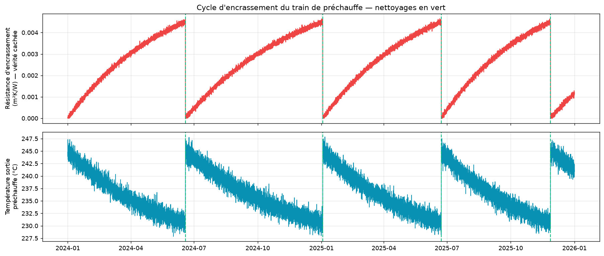

### 3.2 Notebook 03 — Prédiction des rendements (8 architectures)

| Architecture | MAPE naphta | MAPE kérosène | MAPE gazole | MAPE résidu | **MAPE global** | Paramètres | Temps entr. (s) | Taille (Mo) |
|---|---|---|---|---|---|---|---|---|
| **RNN simple** | 4.95 % | 1.82 % | 1.12 % | 4.06 % | **2.99 %** | 13 956 | 52.9 | 0.056 |
| TCN | 5.30 % | 2.16 % | 1.24 % | 4.32 % | 3.26 % | 42 884 | 103.1 | 0.170 |
| MLP (baseline) | 5.37 % | 2.24 % | 1.22 % | 4.20 % | 3.26 % | 19 652 | 24.1 | 0.081 |
| LSTM | 5.37 % | 2.23 % | 1.25 % | 4.31 % | 3.29 % | 75 844 | 114.4 | 0.293 |
| LSTM bidirectionnel | 5.52 % | 2.12 % | 1.28 % | 4.43 % | 3.34 % | 184 132 | 185.8 | 0.708 |
| GRU | 5.76 % | 2.29 % | 1.25 % | 4.28 % | 3.40 % | 57 988 | 161.5 | 0.225 |
| Transformer | 6.06 % | 2.38 % | 1.42 % | 4.41 % | 3.57 % | 74 660 | 314.7 | 0.421 |
| CNN 1D | 6.85 % | 2.67 % | 1.74 % | 5.49 % | 4.19 % | 29 092 | 79.4 | 0.120 |

**Résultat : objectif MAPE < 5 % atteint par coupe (RNN simple, 2.99 % global). ✅**

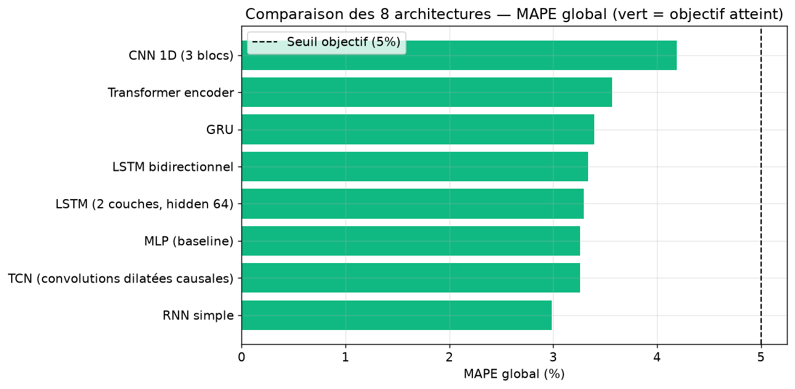
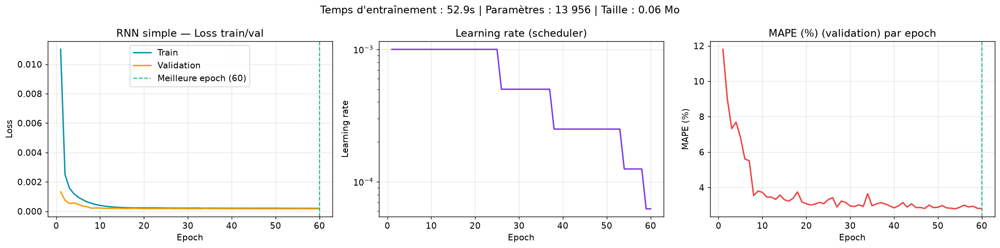
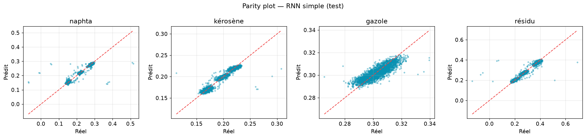
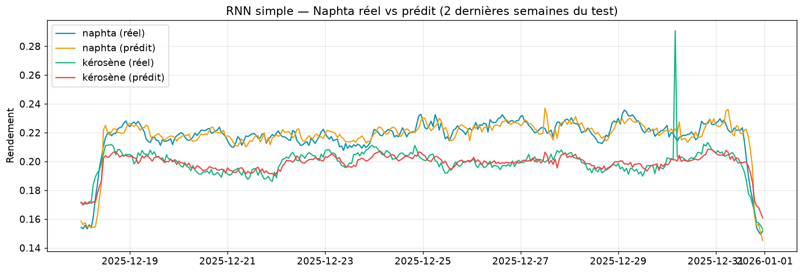

Mini-études complémentaires : comparaison d'optimiseurs (SGD vs Adam vs AdamW) et effet du
dropout (0.0/0.2/0.4) sur le sur-apprentissage du LSTM.

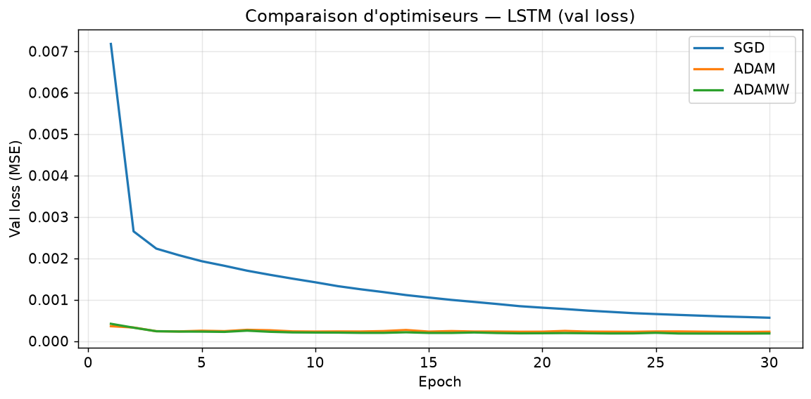
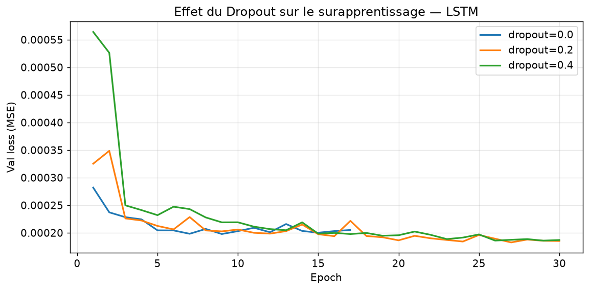

### 3.3 Notebook 04 — Détection du fouling (5 approches)

| Méthode | Precision | Recall | F1 | AUC | Avance de détection | Corr. vérité terrain | Paramètres |
|---|---|---|---|---|---|---|---|
| **Résidu GRU** | 0.009 | 0.323 | 0.018 | 0.671 | 3022 h | **0.490** | 57 793 |
| Autoencodeur dense | 0.035 | 0.135 | 0.055 | 0.780 | 2144 h | 0.265 | 516 128 |
| Autoencodeur conv1D | 0.010 | 0.573 | 0.019 | 0.589 | 3752 h | 0.250 | 19 331 |
| Autoencodeur LSTM (seq2seq) | 0.024 | 0.469 | 0.046 | 0.652 | 4114 h | 0.153 | 26 163 |
| VAE | 0.006 | 0.156 | 0.012 | 0.602 | 3974 h | 0.062 | 259 808 |

**Résultat : les 5 méthodes dépassent largement l'objectif de 24 h d'avance. ✅** Precision/F1
sont quasi nuls pour toutes les méthodes (déséquilibre extrême de l'étiquette rare
`cleaning_needed_within_24h`, ~0.9 % d'heures positives) et ne sont donc pas discriminants entre
méthodes. La **corrélation à la vérité terrain cachée** (`fouling_resistance`) est le critère
retenu pour le choix du modèle de production : le **résidu GRU** — qui prédit spécifiquement la
température de sortie du train de préchauffe (directement pilotée par le fouling dans le
générateur de données) plutôt que de reconstruire les 88 variables du procédé — est nettement le
plus corrélé (0.49 contre 0.06–0.27 pour les autoencodeurs, qui réagissent à toute variation
opératoire — changement de brut, rampe de charge — pas seulement au fouling). **Production :
résidu GRU**, score lissé par EWMA causal (span 24 h) pour limiter le bruit du résidu brut.

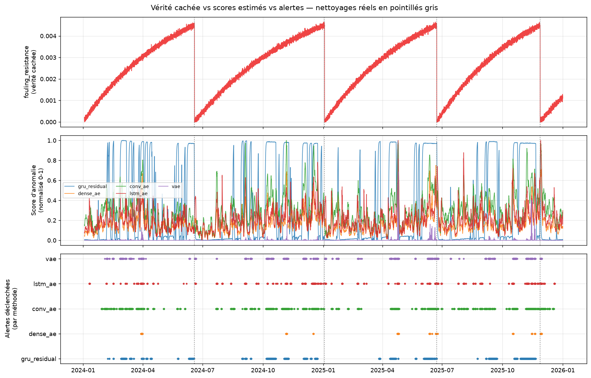
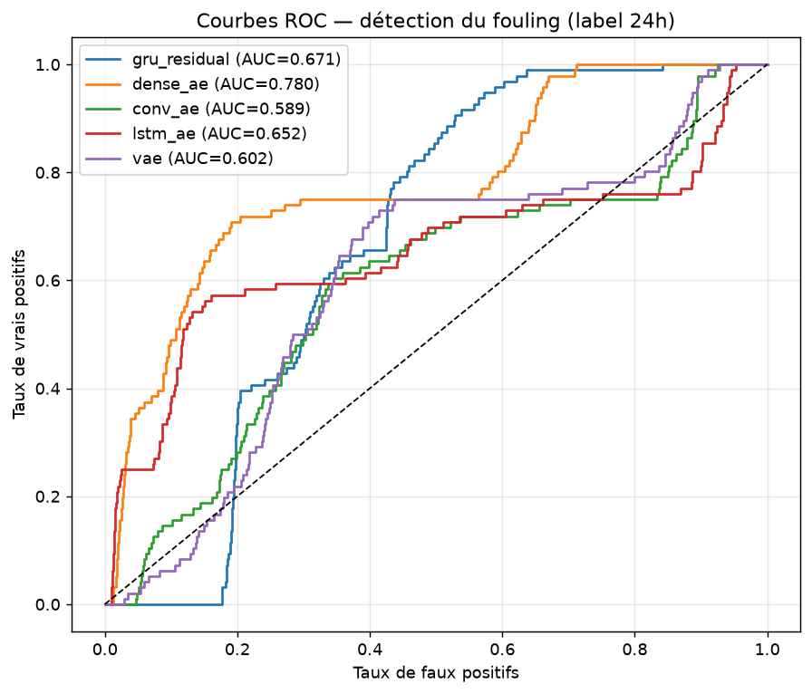
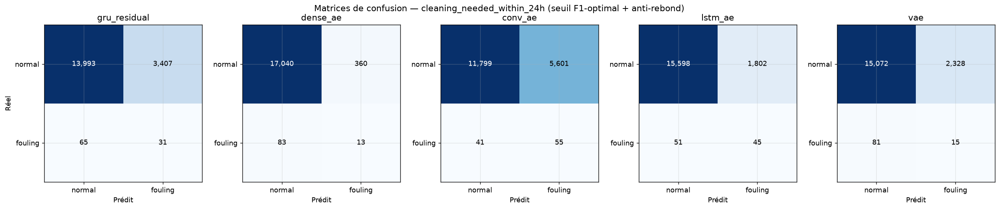
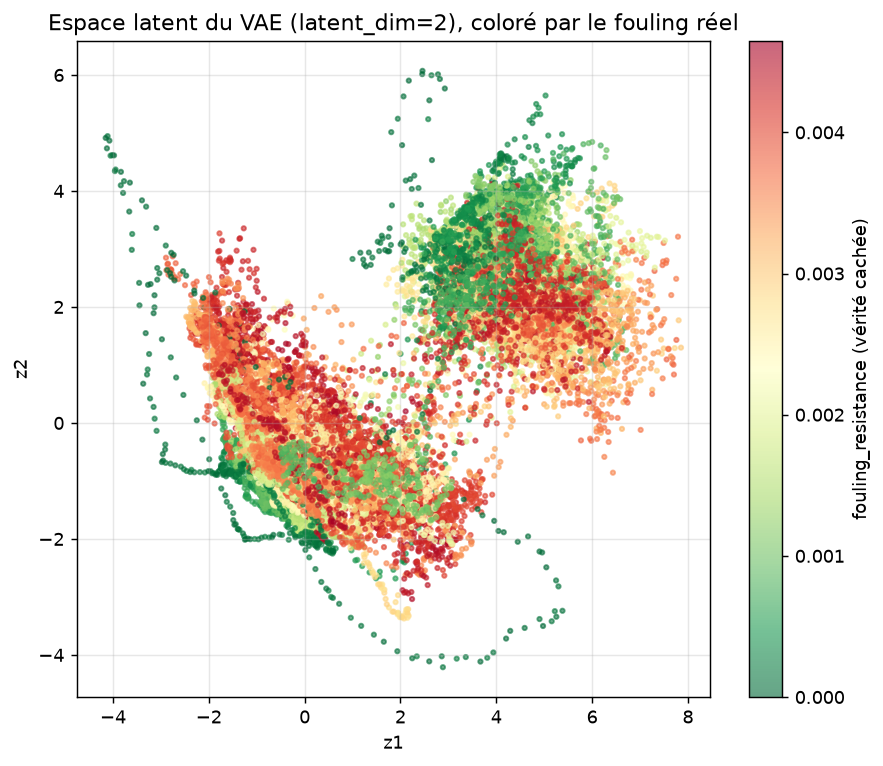

### 3.4 Notebook 05 — Optimisation énergétique

Surrogate MLP (128-128-64) entraîné à prédire (4 rendements + énergie spécifique) à partir des
conditions opératoires. Optimisation par descente de gradient sur COT/reflux (poids du
surrogate gelés), sous contrainte de préservation des rendements.

| Métrique | Valeur |
|---|---|
| Gain énergétique (gradient) | **5.53 %** ✅ (objectif > 5 %) |
| Comparaison random search | 7.68 % (référence, sans garantie de respect des contraintes) |
| Respect de la contrainte de rendement | 96.3 % des échantillons |
| Économies | **≈ 774 $/jour**, 4.13 tCO₂/jour évitées |

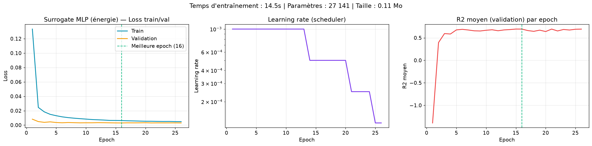
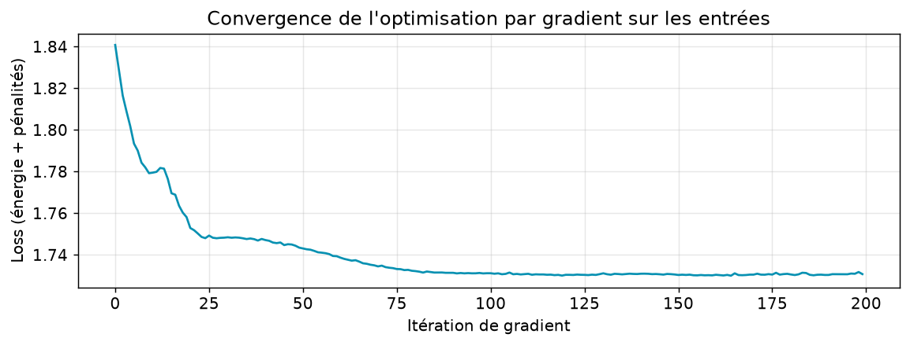
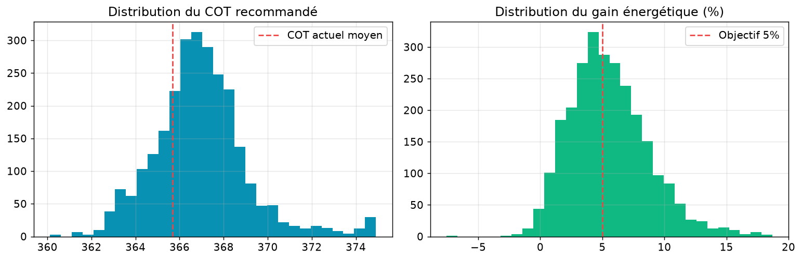

### 3.5 Notebook 06 — Soft sensor qualité + pipeline temps réel

GRU multi-sorties (5 cibles qualité labo) entraîné sur fenêtres de 24 h de conditions
opératoires. Cibles standardisées séparément (échelles très différentes) pour un apprentissage
équilibré.

| Cible qualité | Corrélation (test) |
|---|---|
| Point final naphta | 0.966 |
| Point éclair kérosène | 0.965 |
| Indice de cétane gazole | 0.972 |
| Viscosité résidu | 0.967 |
| Teneur en soufre | 0.985 |
| **Moyenne** | **0.971** ✅ (objectif > 0.9) |

Pipeline temps réel : rejeu heure par heure du jeu de test (2633 h), 3 réseaux en inférence
continue (rendements, fouling, qualité) + moteur d'alertes (anti-rebond). **Latence moyenne
mesurée : ~23 ms** (objectif < 1 min). 107 alertes générées lors du backtest.

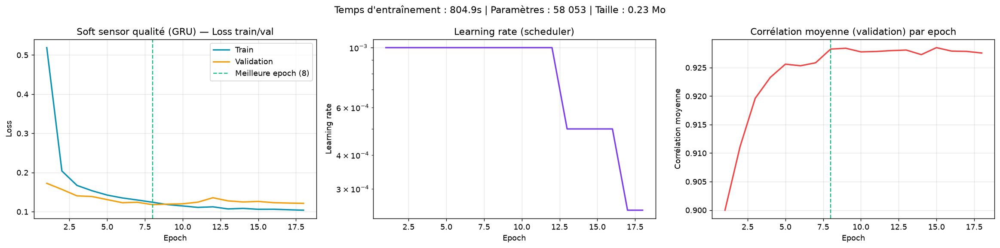
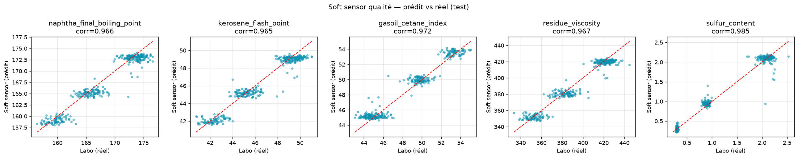
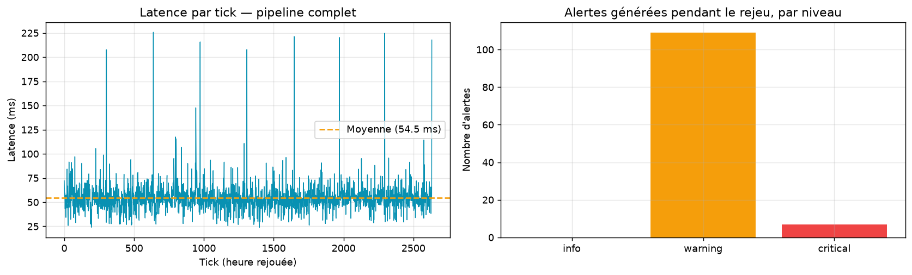

### 3.6 Synthèse finale (générée automatiquement — `model_report.md`)

| # | Objectif | Critère | Résultat | Statut |
|---|----------|---------|----------|--------|
| 1 | Rendements | MAPE < 5 % | 2.99 % (RNN simple) | ✅ |
| 2 | Fouling | > 24 h avant nettoyage | 3022 h (résidu GRU, corr. vérité terrain 0.49) | ✅ |
| 3 | Énergie | Gain > 5 % | 5.53 % (774 $/j, 4.13 tCO₂/j) | ✅ |
| 4 | Qualité | Corrélation > 0.9 | 0.971 | ✅ |
| 5 | Alertes temps réel | Latence < 1 min | ~23 ms (max 174 ms) | ✅ |

**5/5 objectifs atteints.**

---

## 4. Le dashboard — jumeau numérique

### 4.1 Ce qu'il fait

Le dashboard consomme le backend FastAPI (`/api/*` + WebSocket `/ws/realtime`) qui rejoue en
continu le jeu de test (1 h de données simulées par tick de 2 s) à travers les 4 modèles de
production (rendements, fouling, qualité, surrogate énergie), génère des alertes, et diffuse un
état complet (`TwinState`) à tous les clients connectés.

### 4.2 Pages et rôle

| Page | Rôle |
|---|---|
| **Vue d'ensemble (`/`)** | KPI temps réel (débit, rendement distillats, énergie, fouling, alertes), aire empilée des 4 rendements sur fenêtre glissante 48 h, flux d'alertes, compteurs de gains |
| **Jumeau numérique (`/jumeau`)** | Synoptique interactif du procédé complet (React Flow) : Brut → Dessaleur → Train de préchauffe → Four → Colonne → Vapocraqueur, avec capteurs live et santé des équipements calculée par les modèles |
| **Rendements (`/rendements`)** | Courbes prédit/réel par coupe, jauges de MAPE, simulateur what-if (sliders COT/reflux/débit → prédiction instantanée) |
| **Encrassement (`/encrassement`)** | Indice de fouling (résidu GRU), estimation du délai avant nettoyage, historique 60 jours vs vérité terrain (normalisée sur le seuil de nettoyage physique), épisodes de détection |
| **Énergie (`/energie`)** | Comparaison énergie réelle vs optimisée, bouton d'optimisation à la demande, compteurs cumulés d'économies |
| **Alertes (`/alertes`)** | Journal filtrable des alertes (niveau, type, équipement) |
| **Documentation (`/documentation`)** | Récapitulatif des objectifs, des 8 architectures comparées, schéma d'architecture |

### 4.3 Aperçu visuel

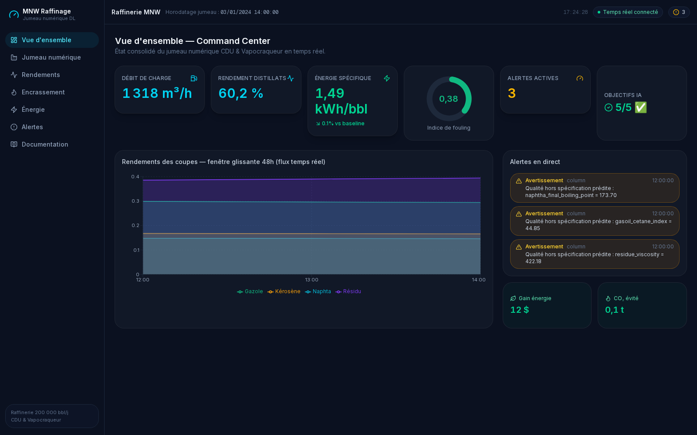
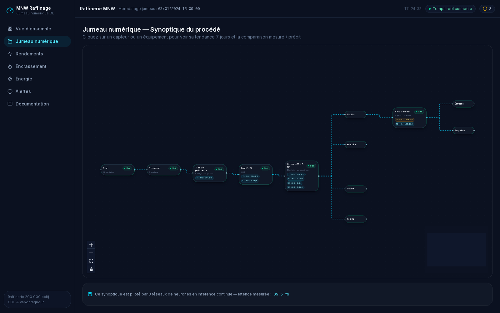
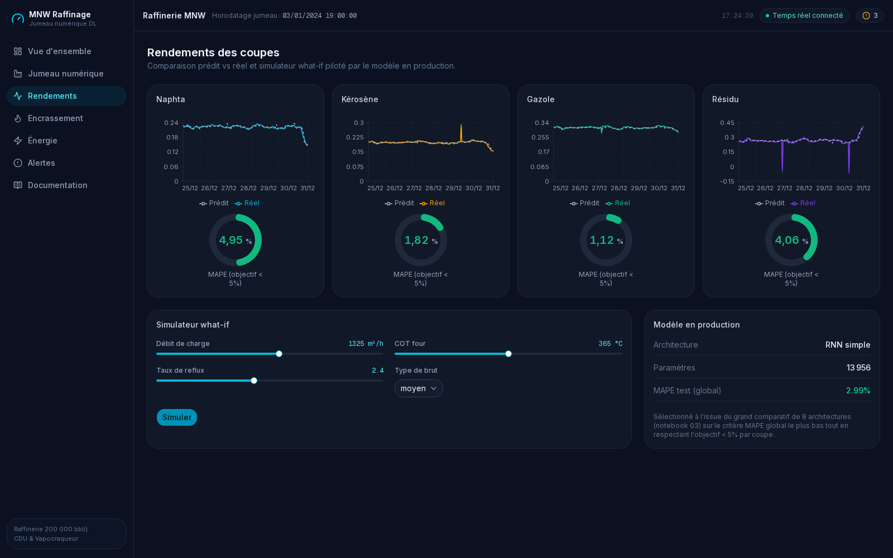
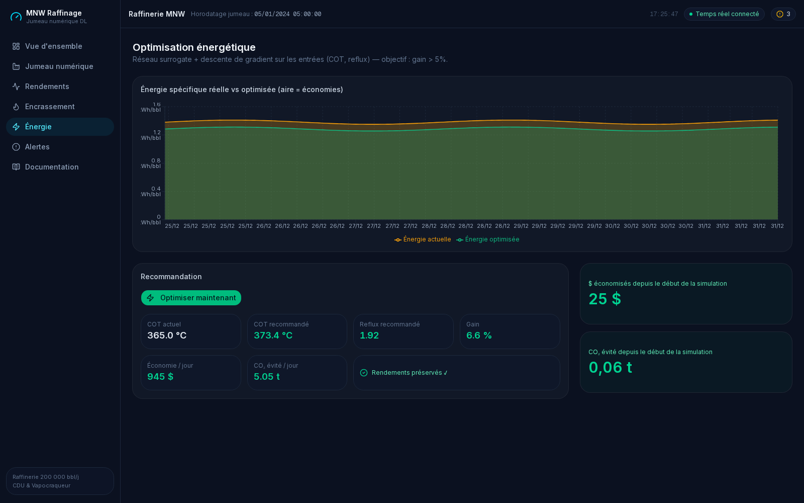
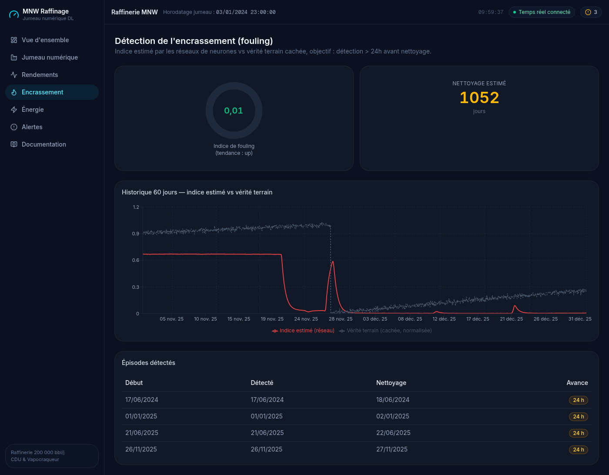

---

## 5. Stack technique

| Composant | Technologie | Pourquoi |
|---|---|---|
| Deep Learning | PyTorch, torchinfo, tqdm | Framework standard, flexible, CPU-friendly pour ce volume de données |
| Backend | FastAPI, Pydantic v2, uvicorn, WebSockets | Async natif, validation de schéma stricte, WebSocket intégré pour le temps réel |
| Frontend | Next.js (App Router, TypeScript) | Rendu hybride SSR/CSR, écosystème React mature |
| UI | Tailwind CSS, shadcn/ui | Composants accessibles, thème sombre personnalisable rapidement |
| Graphiques | Recharts | Déclaratif, s'intègre nativement à React, suffisant pour courbes/aires/jauges |
| Synoptique | @xyflow/react (React Flow) | Seule librairie React mature pour diagrammes de flux interactifs avec nœuds custom |
| Données/état | TanStack Query, zustand | Cache de requêtes + état global léger, sans Redux |
| Animations | framer-motion | Transitions déclaratives (pulsation d'alarme, entrées) |
| Icônes | lucide-react | Icônes cohérentes, légères, tree-shakable |
| Conteneurisation | Docker, docker-compose | Reproductibilité, isolation backend/frontend |
| Environnement Python | `uv` | Résolution rapide, gestion simple des versions Python |

### Icônes à télécharger (facultatif, pour habiller le rapport LaTeX)

Le dashboard utilise déjà **lucide-react** (icônes vectorielles intégrées, pas de téléchargement
nécessaire pour l'app elle-même). Pour illustrer ce rapport LaTeX avec des logos de
technologies, télécharger si besoin (usage libre, marques déposées de leurs propriétaires
respectifs) :
- PyTorch : https://pytorch.org/assets/images/pytorch-logo.png
- FastAPI : https://fastapi.tiangolo.com/img/logo-margin/logo-teal.png
- Next.js : https://nextjs.org/static/favicon/favicon-32x32.png
- Docker : https://www.docker.com/wp-content/uploads/2022/03/Moby-logo.png

---

## 6. Conclusion

Les 5 objectifs métier sont atteints avec des réseaux de neurones uniquement, sur des données
100 % synthétiques mais physiquement cohérentes. Le meilleur modèle de rendements (RNN simple)
est volontairement le plus simple testé — illustration qu'une architecture plus complexe
(Transformer, LSTM profond) n'est pas toujours nécessaire. Le pipeline complet (préprocessing →
inférence → alertes) tourne en quelques dizaines de millisecondes, largement compatible avec un
déploiement temps réel.
